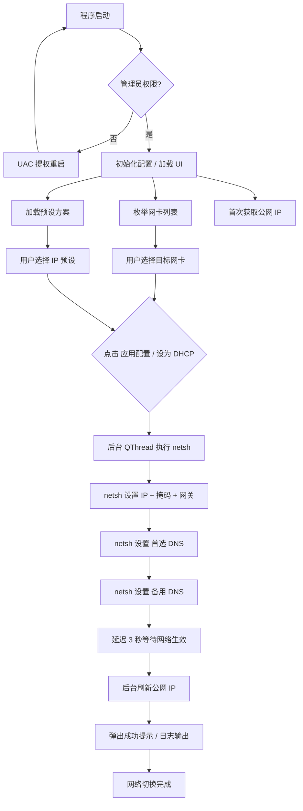

# 🖥️ IP 切换管理器 (IPSwitcher)

<p align="center">
  
  
  
  
  
</p>

<p align="center">
  <b>面向企业多 VLAN 网络环境的 Windows 桌面端网络配置快速切换工具</b>
</p>

---

## 📖 项目简介
本项目作为毕业论文《基于企业场景的NAS存储与网络架构设计与实现》的配套工具开发，用于支撑多VLAN企业网络环境下的网络测试与运维工作。

在企业网络测试环境中，测试终端需要频繁在多个 VLAN 网络之间切换 —— 业务网络、管理网络、运营商出口、加速节点等 —— 每次切换都需手动修改 IP 地址、子网掩码、默认网关和 DNS 服务器，操作繁琐且极易出错。

**IP 切换管理器**将各类网络配置抽象为可复用的**预设方案**，通过图形化界面实现一键切换。选择目标网卡 → 选择预设方案 → 点击应用，三步即可完成网络环境切换，将传统人工配置时间由约 1 分钟缩短至 3 秒以内。

### 🎯 适用场景

- 🏢 **企业多 VLAN 网络测试** — 业务网、管理网、加速网快速切换
- 🌐 **多运营商出口验证** — 电信、移动、联通出口一键切换
- 💾 **NAS 存储网络接入** — 内部存储网络与办公网络间快速跳转
- 🔧 **网络运维与排障** — 快速切换到不同网段进行连通性验证

---

## ✨ 功能特性

| 功能模块 | 说明 |
|---------|------|
| 📋 **配置预设管理** | 支持新增、编辑、删除 IP 配置方案，首次运行自动导入 14 组企业典型场景预设 |
| 🔄 **静态 IP 切换** | 一键将网卡切换为预设的静态 IP / 掩码 / 网关 / DNS 配置 |
| 📡 **DHCP 模式** | 支持切换为 DHCP 自动获取模式，适应动态网络环境 |
| 🖧 **多网卡管理** | 自动枚举所有网络适配器，显示连接名和硬件描述，避免选错网卡 |
| ⚙️ **网卡启停控制** | 可在界面内启用或禁用指定网卡，无需打开控制面板 |
| 🌍 **公网 IP 检测** | 实时获取并显示当前公网出口 IP 及归属地信息，验证切换结果 |
| 📊 **网络状态展示** | 网卡启用/禁用状态以颜色编码徽章直观呈现 |
| 📝 **操作日志** | 每次 netsh 命令执行结果实时输出至日志面板，方便排查问题 |
| 🌓 **双主题支持** | 内置明亮 / 深色两种主题，适应不同工作环境 |
| 📂 **配置文件管理** | 一键打开配置文件夹，支持 JSON 文件的批量导入导出 |
| 🔐 **自动 UAC 提权** | 非管理员运行时自动请求管理员权限，无需手动右键启动 |
| 🛡️ **纯内网模式** | 支持仅配置 IP 与掩码、无需网关和 DNS 的纯内网直连场景 |

---


## 🏗️ 技术架构

```
┌─────────────────────────────────────────────────────────┐
│                    用户界面层 (ui/)                       │
│   main_window.py        config_dialog.py    styles.py   │
│   ┌──────────┐          ┌──────────┐       ┌─────────┐  │
│   │ 主窗口    │─────────▶│ 配置弹窗  │       │ 双主题   │  │
│   │ +QThread │          │ +表单校验 │       │ 样式表   │  │
│   └──────────┘          └──────────┘       └─────────┘  │
├─────────────────────────────────────────────────────────┤
│                    业务逻辑层 (core/)                     │
│   config_manager.py                   network.py        │
│   ┌──────────────────┐       ┌────────────────────┐     │
│   │ JSON 配置读写      │       │ netsh 命令调用       │     │
│   │ 预设模板管理        │       │ PowerShell 接口      │     │
│   │ 自动容错恢复        │       │ 公网 IP 获取         │     │
│   └──────────────────┘       └────────────────────┘     │
├─────────────────────────────────────────────────────────┤
│                  系统接口层 (Windows API)                 │
│   netsh.exe  │  powershell.exe  │  ShellExecuteW  │  urllib │
└─────────────────────────────────────────────────────────┘
```

### 技术栈

| 层级 | 技术 | 说明 |
|------|------|------|
| 语言 | **Python 3.9+** | 跨平台脚本语言，丰富的系统调用生态 |
| GUI | **PyQt6** | Qt 6 的 Python 绑定，原生 Windows 11 Fluent 风格 |
| 构建 | **PyInstaller** | 打包为单文件 Windows 可执行程序 (.exe) |
| 配置存储 | **JSON** | 存储于 `%APPDATA%\IPSwitcher\configs.json` |
| 网络配置 | **netsh** | Windows 原生网络配置命令行工具 |
| 网卡管理 | **PowerShell** | `Get-NetAdapter` / `Enable-NetAdapter` / `Disable-NetAdapter` |
| 权限控制 | **ctypes + ShellExecuteW** | Windows API 调用实现 UAC 提权 |
| 异步处理 | **QThread + pyqtSignal** | 后台线程防止 UI 阻塞 |

---

## 🔄 工作流程



---

## 📁 项目结构

```
ip-switcher/
├── main.py                    # 程序入口（权限检测 + UAC 提权 + 启动 GUI）
├── build.bat                  # PyInstaller 打包脚本（一键构建 .exe）
├── app.manifest               # Windows UAC 清单文件
├── requirements.txt           # Python 依赖声明
├── README.md                  # 项目说明文档
├── screenshots/               # 软件截图（可选）
│   ├── main_window.png
│   ├── config_dialog.png
│   └── apply_log.png
├── core/                      # 业务逻辑层
│   ├── __init__.py
│   ├── config_manager.py      # 配置持久化（JSON 读写 + 默认方案）
│   └── network.py             # 网络操作（netsh / PowerShell / 公网 IP）
└── ui/                        # 用户界面层
    ├── __init__.py
    ├── main_window.py         # 主窗口（布局 + 交互 + QThread 调度）
    ├── config_dialog.py       # 配置编辑对话框（表单校验）
    └── styles.py              # 双主题 Qt 样式表（明亮 / 深色）
```

---

## 🚀 使用方法

### 环境要求

- **操作系统**：Windows 10 / 11（64 位）
- **运行权限**：**管理员权限**（修改网络配置必需）
- **Python**（开发模式）：3.9 及以上

### 方式一：直接运行可执行程序

1. 下载发行版中的 `IPSwitcher.exe`
2. 右键 → **以管理员身份运行**（程序也会自动请求提权）
3. 程序启动后自动加载配置和网卡列表

### 方式二：从源码运行

```bash
# 克隆仓库
git clone https://github.com/yourname/ip-switcher.git
cd ip-switcher

# 安装依赖
pip install -r requirements.txt

# 以管理员权限运行（Windows Terminal / PowerShell 管理员模式）
python main.py
```

### 方式三：自行打包

```bash
# 在 ip-switcher 目录下执行
build.bat
# 输出：dist\IPSwitcher.exe
```

### 操作步骤

#### 切换静态 IP

1. 在顶部下拉框**选择目标网卡**（右侧会显示网卡状态和硬件型号）
2. 在左侧列表中**选择预设配置方案**
3. 点击底部 **「▶ 应用配置」** 按钮
4. 等待 netsh 命令执行完成（日志面板实时显示进度）
5. 3 秒后公网 IP 自动刷新，验证切换结果

#### 切换为 DHCP

1. 选择需恢复为 DHCP 的目标网卡
2. 点击底部 **「设为 DHCP」** 按钮
3. 确认弹窗后自动执行 IP + DNS 双项切换

#### 管理预设配置

- **新增**：点击「新增」→ 填写配置名称、IP、掩码（网关/DNS 可选）→ 确定
- **编辑**：选中预设 → 点击「编辑」→ 修改参数 → 确定
- **删除**：选中预设 → 点击「删除」→ 确认删除

#### 管理网卡

- **启用网卡**：选择网卡后点击绿色「启用网卡」按钮
- **禁用网卡**：选择网卡后点击红色「禁用网卡」按钮
- **刷新列表**：点击「刷新」按钮重新枚举所有网卡

---

## 🏭 典型应用场景

### 场景一：企业多 VLAN 网络测试

测试终端在多 VLAN 交换机下，需在不同网段间快速跳转：

| VLAN | 用途 | 网段示例 |
|------|------|---------|
| VLAN 18 | 业务网络 | 192.168.18.x/24 |
| VLAN 20 | 管理网络 | 192.168.20.x/24 |
| VLAN 40 | 移动家宽 | 192.168.40.x/24 |
| VLAN 50 | 集中加速 | 192.168.50.x/24 |

> 预先配置好每个 VLAN 对应的 IP 方案后，测试人员只需 2 次点击即可完成网段切换。

### 场景二：多运营商出口验证

加速业务需分别验证电信、移动、联通等不同出口线路的路由和延迟：

1. 切换到电信出口 → 验证 → 记录延迟数据
2. 切换到移动出口 → 验证 → 记录延迟数据
3. 切换到联通出口 → 验证 → 记录延迟数据

公网 IP 自动刷新功能可即时确认出口信息，无需额外打开浏览器查询。

### 场景三：NAS 存储网络切换

企业内部 NAS 存储通常部署于独立 VLAN（如 VLAN 4094），测试终端需要：
- 办公时段使用业务网络访问互联网
- 数据备份时切换至 NAS 网络进行大文件传输

纯内网模式（仅配 IP 和掩码，无需网关和 DNS）可直接覆盖此类场景。

### 场景四：福州节点多出口测试

测试终端接入福州节点后，需验证日韩、法兰克福、香港等多条国际出口的路由质量，频繁切换不同的出口 IP 及对应的 DNS 服务器。

---

## 💡 开发背景

本项目最初为解决企业多 VLAN 网络测试环境中频繁手动修改 IP 配置的痛点而开发。在《基于企业场景的 NAS 存储与网络架构设计与实现》项目实践中，多网络环境间的快速切换成为高频操作，手工配置方式严重影响测试效率。

基于此需求，开发了这款可视化的网络配置管理工具，将原本需要进入 3～4 级系统设置面板、逐项填写 5～6 个网络参数的操作简化为一键完成。随着项目推进，陆续加入了网卡启停控制、公网 IP 检测、纯内网模式、深色主题等功能，使其从单一的 IP 切换工具演进为一款完整的 Windows 网络配置管理客户端。

项目源代码已开源发布，用于支撑企业网络测试环境和NAS存储系统的部署与验证。

---

## 🤝 贡献

欢迎提交 Issue 和 Pull Request！如有功能建议或问题反馈，请在 GitHub Issues 中提出。

---

## 📄 许可证

本项目采用 [MIT License](LICENSE) 开源。

---

<p align="center">
  <sub>Made with ❤️ by Song Ruifeng</sub>
</p>
